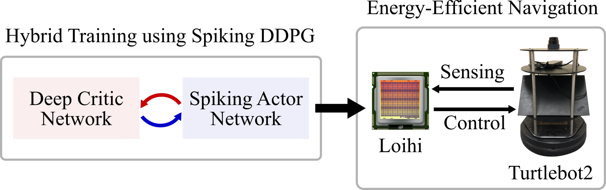
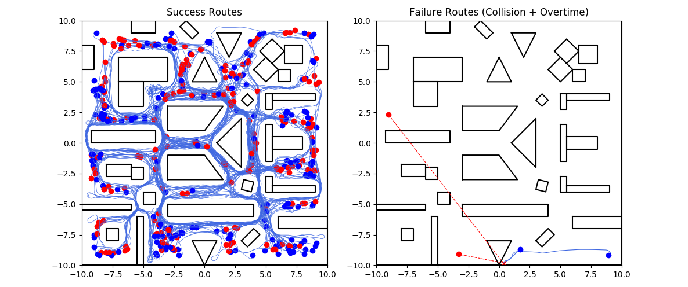

# Spiking Neural Network for Mapless Navigation #

This package is the PyTorch implementation of the **S**piking **D**eep **D**eterministic **P**olicy **G**radient (**SDDPG**) framework.
The hybrid framework trains a spiking neural network (SNN) for energy-efficient mapless navigation on Intel's Loihi neuromorphic processor.

The following figure shows an overview of the proposed method:



The paper has been accepted at IROS 2020. 
The arXiv preprint is available [here](https://arxiv.org/abs/2003.01157).
The IEEE Xplore published version is available [here](https://ieeexplore.ieee.org/abstract/document/9340948).

**New**: We have created a new GitHub repo to demonstrate the online runtime interaction with Loihi. If you are interested in using Loihi for real-time robot control, please [check it out](https://github.com/michaelgzt/loihi-control-loop-demo).

## Citation ##

G. Tang, N. Kumar and K. P. Michmizos, **"Reinforcement co-Learning of Deep and Spiking Neural Networks for Energy-Efficient Mapless Navigation with Neuromorphic Hardware,"** 2020 IEEE/RSJ International Conference on Intelligent Robots and Systems (IROS), 2020, pp. 6090-6097, doi: 10.1109/IROS45743.2020.9340948.

```bibtex
@inproceedings{tang2020reinforcement,
  author={Tang, Guangzhi and Kumar, Neelesh and Michmizos, Konstantinos P.},
  booktitle={2020 IEEE/RSJ International Conference on Intelligent Robots and Systems (IROS)}, 
  title={Reinforcement co-Learning of Deep and Spiking Neural Networks for Energy-Efficient Mapless Navigation with Neuromorphic Hardware}, 
  year={2020},
  pages={6090-6097},
  doi={10.1109/IROS45743.2020.9340948}}
```

## Software Installation ##

#### 1. Basic Requirements

* Ubuntu 16.04
* Python 3.5.2
* ROS Kinetic (with Gazebo 7.0)
* PyTorch 1.2 (with CUDA 10.0 and tensorboard 2.1)
* NxSDK 0.9

ROS Kinetic is not compatible with Python 3 by default, if you have issues with using Python 3 with ROS, please follow this [link](https://medium.com/@beta_b0t/how-to-setup-ros-with-python-3-44a69ca36674) to resolve them. We use the default Python 2 environment to execute `roslaunch` and `rosrun`.

A CUDA enabled GPU is not required but preferred for training within the SDDPG framework. 
The results in the paper are generated from models trained using both Nvidia Tesla K40c and Nvidia GeForce RTX 2080Ti.

Intel's neuromorphic library NxSDK is only required for SNN deployment on Loihi. 
If you are interested in deploying the trained SNN on Loihi, please contact the [Intel Neuromorphic Lab](https://www.intel.com/content/www/us/en/research/neuromorphic-community.html).

We have provided the `requirements.txt` for the python environment without NxSDK. In addition, we recommend setting up the environment using [virtualenv](https://pypi.org/project/virtualenv/).

#### 2. Simulation Setup

The simulation environment simulates a Turtlebot2 robot with a 360 degree LiDAR in the Gazebo simulator.

Turtlebot2 dependency can be installed using:

```bash
sudo apt-get install ros-kinetic-turtlebot-*
```

We use the Hokuyo LiDAR model in the simulation and set the parameters to be the same as the RPLIDAR S1.
LiDAR dependency can be installed using:

```bash
sudo apt-get install ros-kinetic-urg-node
```

Download the project and compile the catkin workspace:

```bash
cd <Dir>/<Project Name>/ros/catkin_ws
catkin_make
```

Add the following line to your `~/.bashrc` in order for ROS environment to setup properly:

```bash
source <Dir>/<Project Name>/ros/catkin_ws/devel/setup.bash
export TURTLEBOT_3D_SENSOR="hokuyo"
```

Run `source ~/.bashrc` afterward and test the environment setup by running (use Python 2 environment):

```bash
roslaunch turtlebot_lidar turtlebot_world.launch
```

You should able to see the Turtlebot2 with a LiDAR on the top.

#### 3. Real-world Setup

We install the [RPLIDAR S1](https://www.slamtec.com/en/Lidar/S1) on the center of the top level of Turtlebot2.
To use the LiDAR with ROS, you need to download and install the rplidar_ros library from [here](https://github.com/robopeak/rplidar_ros) on the laptop controlling Turtlebot2.

After installing the library, you need to add the LiDAR to the tf tree.
This can be done by adding a tf publisher node in `minimal.launch` from `turtlebot_bringup` package:

```xml
<node name="base2laser" pkg="tf" type="static_transform_publisher" args="0 0 0 0 0 1 0 /base_link /laser 50">
```

Test the setup by running (use Python 2 environment):

```bash
roslaunch turtlebot_bringup minimal.launch
```

and

```bash
roslaunch rplidar_ros rplidar_s1.launch
```

in separate terminals on the laptop controlling Turtlebot2.

## Example Usage ##

#### 1. Training SDDPG ####

To train the SDDPG, you need to first launch the training world including 4 different environments (use Python 2 environment and absolute path for `<Dir>`):

```bash
roslaunch turtlebot_lidar turtlebot_world.launch world_file:=<Dir>/<Project Name>/ros/worlds/training_worlds.world
```

Then, run the `laserscan_simple` ros node in a separate terminal to sample laser scan data every 10 degrees (use Python 2 environment):

```bash
rosrun simple_laserscan laserscan_simple
```

Now, we have all ros prerequisites for training. Execute the following commands to start the training in a new terminal (use Python 3 environment):

```bash
source <Dir to Python 3 Virtual Env>/bin/activate
cd <Dir>/<Project Name>/training/train_spiking_ddpg
python train_sddpg.py --cuda 1 --step 5
```

This will automatically train 1000 episodes in the training environments and save the trained parameters every 10k steps.
Intermediate training results are also saved through tensorboard.

If you want to perform the training on CPU, you can set `--cuda` to 0. 
You can also train for different inference timesteps of SNN by setting `--step` to the desired number. 

In addition, we also have the state-of-the-art DDPG implementation that trains a non-spiking deep actor network for mapless navigation.
If you want to train the DDPG network, run the following commands to start the training in a new terminal (use Python 3 environment):

```bash
source <Dir to Python 3 Virtual Env>/bin/activate
cd <Dir>/<Project Name>/training/train_ddpg
python train_ddpg.py --cuda 1
```

#### 2. Evaluate in simulated environment ####

To evaluate the trained Spiking Actor Network (SAN) in Gazebo, you need to first launch the evaluation world (use Python 2 environment and absolute path for `<Dir>`):

```bash
roslaunch turtlebot_lidar turtlebot_world.launch world_file:=<Dir>/<Project Name>/ros/worlds/evaluation_world.world
```

Then, run the `laserscan_simple` ros node in a separate terminal to sample laser scan data every 10 degrees (use Python 2 environment):

```bash
rosrun simple_laserscan laserscan_simple
```

Now, we have all ros prerequisites for evaluation. Run the following commands to start the evaluation in a new terminal (use Python 3 environment):

```bash
source <Dir to Python 3 Virtual Env>/bin/activate
cd <Dir>/<Project Name>/evaluation/eval_random_simulation
python run_sddpg_eval.py --save 0 --cuda 1 --step 5
```

This will automatically navigate the robot for 200 randomly generate start and goal positions. 
The full evaluation will cost more than 2 hours.

If you want to perform the evaluation on CPU, you can set `--cuda` to 0. 
You can also evaluate for different inference timesteps of SNN by setting `--step` to the desired number.

To deploy the trained SAN on Loihi and evaluate in Gazebo, you need to have the Loihi hardware. 
If you have the Kapoho Bay USB chipset, run the following commands to start the evaluation (use Python 3 environment):

```bash
source <Dir to Python 3 Virtual Env>/bin/activate
cd <Dir>/<Project Name>/evaluation/eval_random_simulation_loihi
KAPOHOBAY=1 python run_sddpg_loihi_eval.py --save 0 --step 5
```

You can also evaluate for different inference timesteps of SNN by setting `--step` to the desired number.
In addition, you also need to change the `epoch` value in the `<Project Name>/evaluation/loihi_network/snip/encoder.c` file corresponding to the inference timesteps.

For both evaluations, you can set `--save` to 1 to save the robot routes and time.
These running histories are then used to generate the results shown in the paper. 
Run the following commands to evaluate the history by yourself (use Python 3 environment):

```bash
source <Dir to Python 3 Virtual Env>/bin/activate
cd <Dir>/<Project Name>/evaluation/result_analyze
python generate_results.py
```

You should be able to get the following results for evaluating the SAN on GPU with T=5:

```bash
sddpg_bw_5 random simulation results:
Success:  198  Collision:  2  Overtime:  0
Average Path Distance of Success Routes:  18.539 m
Average Path Time of Success Routes:  42.519 s
```



with red dot as goal positions, blue dot as start positions, and red cross as collision positions.

#### 3. Evaluate in real-world environment ####

Our implementation of real-world evaluate relies on the **amcl** to localize the robot and generate relative goal positions.
Therefore, to evaluate the trained SNN in real-world environment, you have to first generate a map of the environment using GMapping (use Python 2 environment):

```bash
roslaunch turtlebot_lidar gmapping_lplidar_demo.launch
```

Then, you can use the saved map to localize the robot's pose (use Python 2 environment):

```bash
roslaunch turtlebot_lidar amcl_lplidar_demo.launch map_file:=<Dir to map>
```

You can view the robot navigation using **rviz** by running in a separate terminal (use Python 2 environment):

```bash
roslaunch turtlebot_rviz_launchers view_navigation.launch
```

After verifying that the robot can correctly localize itself in the environment, you can start to evaluate the trained SNN.
Here, we only support the evaluation on Loihi.
To deploy the trained SNN on Loihi, you need to have the Loihi hardware.
If you have the Kapoho Bay USB chipset, run the following commands to start the evaluation (use Python 3 environment):

```bash
source <Dir to Python 3 Virtual Env>/bin/activate
cd <Dir>/<Project Name>/evaluation/eval_real_world
KAPOHOBAY=1 python run_sddpg_loihi_eval_rw.py
```

For your own environment, remember to change the `GOAL_LIST` in the evaluation script to the appropriate goal positions for the environment.

### Acknowledgment ###

This work is supported by Intel's Neuromorphic Research Community Grant Award.
